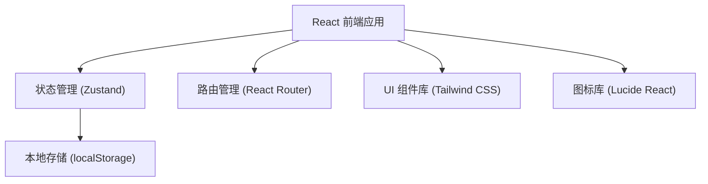

## 1. 架构设计



## 2. 技术描述

- **前端框架**：React@18 + TypeScript
- **构建工具**：Vite@5
- **样式方案**：Tailwind CSS@3
- **状态管理**：Zustand@4
- **路由管理**：react-router-dom@6
- **图标库**：lucide-react
- **数据持久化**：localStorage（无需后端，纯前端本地存储）
- **初始化工具**：vite-init（react-ts 模板）

## 3. 路由定义

| 路由路径 | 页面名称 | 用途 |
|----------|----------|------|
| / | 衣橱页 | 展示和管理衣物单品，上传新衣物 |
| /transform | 改造模板页 | 展示各类改造方案和灵感 |
| /styling | 搭配试排页 | 拖拽式穿搭组合画布 |
| /scenes | 场景推荐页 | 按场景筛选穿搭推荐 |

## 4. 数据模型

### 4.1 数据类型定义

```typescript
// 衣物类别
type ClothingCategory = 'top' | 'bottom' | 'outerwear' | 'dress' | 'shoes' | 'accessory';

// 衣物单品
interface ClothingItem {
  id: string;
  name: string;
  category: ClothingCategory;
  color: string;
  imageUrl: string; // base64 或 图片URL
  createdAt: number;
}

// 改造模板类别
type TransformCategory = 'cut' | 'dye' | 'patchwork' | 'decorate';

// 改造模板
interface TransformTemplate {
  id: string;
  title: string;
  category: TransformCategory;
  description: string;
  difficulty: 1 | 2 | 3 | 4 | 5;
  steps: string[];
  beforeImage: string;
  afterImage: string;
}

// 场景类型
type SceneType = 'class' | 'commute' | 'travel' | 'photo' | 'date';

// 搭配方案
interface Outfit {
  id: string;
  name: string;
  items: string[]; // ClothingItem.id 数组
  scene?: SceneType;
  createdAt: number;
}

// 画布上的元素位置
interface CanvasItem {
  clothingId: string;
  x: number;
  y: number;
  width: number;
  height: number;
}
```

### 4.2 应用状态（Zustand Store）

```typescript
interface AppState {
  // 衣橱
  clothingItems: ClothingItem[];
  addClothingItem: (item: Omit<ClothingItem, 'id' | 'createdAt'>) => void;
  removeClothingItem: (id: string) => void;
  
  // 搭配
  outfits: Outfit[];
  currentCanvasItems: CanvasItem[];
  addOutfit: (outfit: Omit<Outfit, 'id' | 'createdAt'>) => void;
  removeOutfit: (id: string) => void;
  updateCanvasItems: (items: CanvasItem[]) => void;
  clearCanvas: () => void;
}
```

## 5. 项目目录结构

```
src/
├── components/          # 可复用组件
│   ├── ClothingCard.tsx    # 衣物卡片
│   ├── TransformCard.tsx   # 改造模板卡片
│   ├── OutfitCard.tsx      # 搭配卡片
│   ├── Navbar.tsx          # 导航栏
│   ├── UploadModal.tsx     # 上传弹窗
│   └── CategoryTag.tsx     # 分类标签
├── pages/               # 页面组件
│   ├── Wardrobe.tsx        # 衣橱页
│   ├── Transform.tsx       # 改造模板页
│   ├── Styling.tsx         # 搭配试排页
│   └── Scenes.tsx          # 场景推荐页
├── store/               # 状态管理
│   └── useStore.ts         # Zustand store
├── data/                # 静态数据
│   ├── transforms.ts       # 改造模板 mock 数据
│   └── scenes.ts           # 场景推荐 mock 数据
├── utils/               # 工具函数
│   └── image.ts            # 图片处理工具
├── types/               # 类型定义
│   └── index.ts
├── App.tsx
├── main.tsx
└── index.css
```

## 6. 核心功能实现要点

### 6.1 图片上传处理
- 使用 `FileReader` 将上传图片转为 base64 存储
- 压缩图片以节省 localStorage 空间
- 支持拖拽上传和点击上传

### 6.2 拖拽搭配实现
- 使用原生 HTML5 Drag and Drop API
- 画布元素支持拖拽定位
- 支持从单品区拖拽到画布

### 6.3 本地存储
- 使用 localStorage 持久化衣橱和搭配数据
- 初始化时从 localStorage 加载
- 数据变更时自动保存

### 6.4 响应式适配
- 使用 Tailwind 响应式断点
- 移动端优化交互方式
